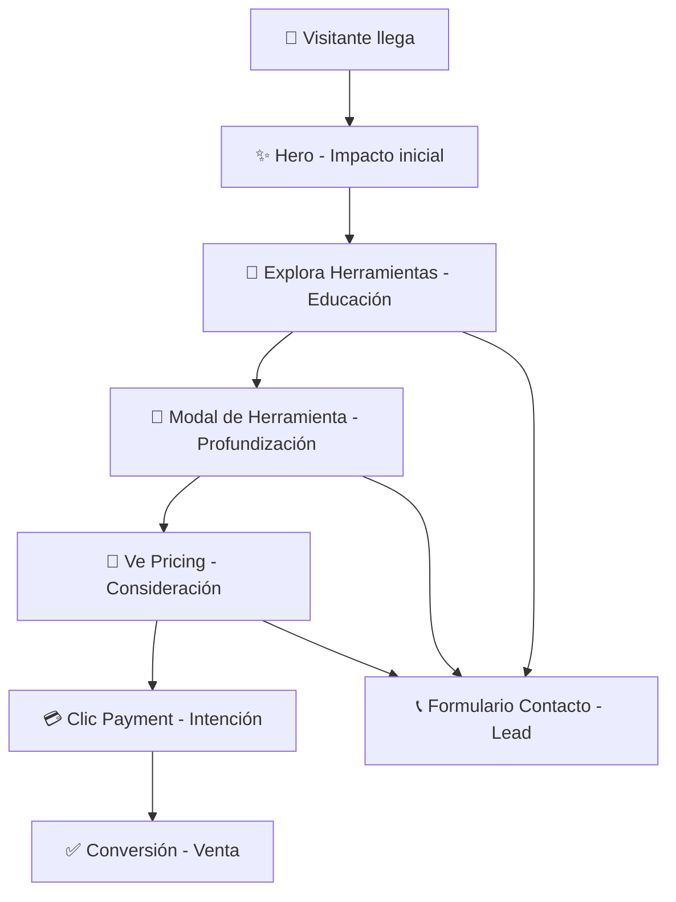

# PLAN DE CAPA DE DATOS (DATA LAYER) PARA GTM V1.0

**Fecha de Creación:** 30 de septiembre de 2025  
**Arquitecto:** Mauro D. Asuaje G.  
**Proyecto:** IKU - Cábala Activa  
**Versión:** 1.0  
**Estado:** 🚧 PLANIFICACIÓN - Ready for Implementation

---

## 🎯 **OBJETIVO ESTRATÉGICO**

Implementar una **arquitectura de medición basada en datos** que nos permita:
- **Medir conversiones** con precisión quirúrgica
- **Optimizar campañas** de Google Ads y Meta con datos reales
- **Identificar puntos de fricción** en el embudo de conversión
- **Maximizar ROI** de las inversiones en marketing digital
- **Escalar científicamente** la adquisición de clientes

---

## 🏗️ **ARQUITECTURA DEL EMBUDO DE CONVERSIÓN**



---

## 🔥 **EVENTOS DE CONVERSIÓN PRIMARIA**

### 1. `generate_lead`
**📌 Disparador:** Envío exitoso del formulario de contacto  
**🎯 Objetivo:** Medir generación de leads calificados  
**📊 Datos a Enviar:**
```javascript
window.dataLayer.push({
  'event': 'generate_lead',
  'form_location': 'contact_modal', // hero_contact | pricing_contact | faq_contact | tool_modal_contact
  'lead_source': 'organic', // paid_ads | organic | social | referral
  'tool_of_interest': 'carta-astral', // carta | constelacion | meditacion | limpieza | paquete-transformacion | general
  'value': 50, // Valor promedio estimado de un lead
  'currency': 'USD'
});
```

### 2. `click_to_payment`
**📌 Disparador:** Clic en cualquier botón de pago (Stripe o PayPal)  
**🎯 Objetivo:** Medir intención de compra  
**📊 Datos a Enviar:**
```javascript
window.dataLayer.push({
  'event': 'click_to_payment',
  'product_id': 'carta-astral', // carta | constelacion | meditacion | limpieza | paquete-transformacion
  'product_name': 'Carta Astral Cabalística',
  'value': 97,
  'currency': 'USD',
  'payment_provider': 'stripe', // stripe | paypal | stripe_installments
  'payment_method': 'single_payment', // single_payment | installments
  'click_location': 'pricing_section' // pricing_section | tool_modal | contact_modal
});
```

### 3. `purchase`
**📌 Disparador:** Confirmación de pago exitoso (página de éxito)  
**🎯 Objetivo:** Medir conversiones reales  
**📊 Datos a Enviar:**
```javascript
window.dataLayer.push({
  'event': 'purchase',
  'transaction_id': 'TXN_12345',
  'value': 997,
  'currency': 'USD',
  'items': [{
    'item_id': 'paquete-transformacion',
    'item_name': 'Paquete de Transformación Completa',
    'category': 'spiritual_tools',
    'quantity': 1,
    'price': 997
  }]
});
```

---

## ⚡ **EVENTOS DE MICRO-CONVERSIÓN Y ENGAGEMENT**

### 4. `open_tool_modal`
**📌 Disparador:** Clic en una tarjeta de la sección "Herramientas"  
**🎯 Objetivo:** Medir interés en herramientas específicas  
**📊 Datos a Enviar:**
```javascript
window.dataLayer.push({
  'event': 'open_tool_modal',
  'tool_id': 'carta-astral',
  'tool_name': 'Carta Astral Cabalística',
  'tool_price': 97,
  'modal_source': 'herramientas_section'
});
```

### 5. `scroll_to_pricing`
**📌 Disparador:** Usuario llega a la sección de precios (scroll 25%)  
**🎯 Objetivo:** Medir cuántos visitantes consideran los precios  
**📊 Datos a Enviar:**
```javascript
window.dataLayer.push({
  'event': 'scroll_to_pricing',
  'scroll_depth': '25', // 25% de la sección pricing
  'time_on_page': 120 // segundos transcurridos
});
```

### 6. `pricing_plan_view`
**📌 Disparador:** Usuario visualiza por más de 3 segundos un plan específico  
**🎯 Objetivo:** Identificar planes que generan más interés  
**📊 Datos a Enviar:**
```javascript
window.dataLayer.push({
  'event': 'pricing_plan_view',
  'plan_id': 'paquete-transformacion',
  'plan_name': 'Paquete de Transformación Completa',
  'plan_price': 997,
  'view_duration': 5 // segundos mirando el plan
});
```

### 7. `cta_click`
**📌 Disparador:** Clic en botones CTA principales  
**🎯 Objetivo:** Medir efectividad de CTAs  
**📊 Datos a Enviar:**
```javascript
window.dataLayer.push({
  'event': 'cta_click',
  'cta_text': 'Ver Planes de Inversión',
  'cta_location': 'hero_section', // hero_section | cta_section | tool_modal
  'cta_type': 'primary' // primary | secondary
});
```

### 8. `whatsapp_click`
**📌 Disparador:** Clic en botón de WhatsApp flotante  
**🎯 Objetivo:** Medir uso del canal WhatsApp  
**📊 Datos a Enviar:**
```javascript
window.dataLayer.push({
  'event': 'whatsapp_click',
  'source_page': 'home',
  'widget_type': 'floating_button'
});
```

### 9. `social_media_click`
**📌 Disparador:** Clic en enlaces a redes sociales  
**🎯 Objetivo:** Medir engagement en redes sociales  
**📊 Datos a Enviar:**
```javascript
window.dataLayer.push({
  'event': 'social_media_click',
  'platform': 'instagram', // instagram | facebook | youtube | tiktok | telegram | twitter
  'link_location': 'footer' // header | footer | contact_section
});
```

### 10. `video_engagement`
**📌 Disparador:** Interacción con videos (si implementamos)  
**🎯 Objetivo:** Medir engagement con contenido multimedia  
**📊 Datos a Enviar:**
```javascript
window.dataLayer.push({
  'event': 'video_play',
  'video_title': 'Introducción a la Cábala',
  'video_duration': 180,
  'video_current_time': 30
});
```

---

## 📈 **EVENTOS DE ANÁLISIS DE COMPORTAMIENTO**

### 11. `page_scroll_depth`
**📌 Disparador:** Scroll profundo (25%, 50%, 75%, 100%)  
**🎯 Objetivo:** Medir engagement y calidad del contenido  
**📊 Datos a Enviar:**
```javascript
window.dataLayer.push({
  'event': 'page_scroll_depth',
  'scroll_depth_threshold': 75,
  'page_location': window.location.pathname
});
```

### 12. `time_on_page_milestone`
**📌 Disparador:** Tiempo en página (30s, 60s, 120s, 300s)  
**🎯 Objetivo:** Identificar contenido que retiene usuarios  
**📊 Datos a Enviar:**
```javascript
window.dataLayer.push({
  'event': 'time_on_page_milestone',
  'time_threshold': 120, // segundos
  'page_section': 'hero_section' // hero_section | herramientas | pricing | testimonials
});
```

### 13. `exit_intent`
**📌 Disparador:** Usuario mueve el cursor fuera de la ventana  
**🎯 Objetivo:** Activar estrategias de retención  
**📊 Datos a Enviar:**
```javascript
window.dataLayer.push({
  'event': 'exit_intent',
  'page_location': window.location.pathname,
  'time_on_page': 90,
  'scroll_depth': 40
});
```

---

## 🛠️ **CONFIGURACIÓN TÉCNICA PARA IMPLEMENTACIÓN**

### **Fase 1: Configuración Base**
1. **Instalar GTM Container** en el `<head>` de `index.html`
2. **Configurar Google Analytics 4** desde GTM
3. **Implementar dataLayer base** en componente principal

### **Fase 2: Eventos Críticos (Prioridad Alta)**
- `generate_lead`
- `click_to_payment` 
- `purchase`
- `open_tool_modal`
- `scroll_to_pricing`

### **Fase 3: Eventos de Optimización (Prioridad Media)**
- `cta_click`
- `pricing_plan_view`
- `page_scroll_depth`
- `whatsapp_click`

### **Fase 4: Eventos Avanzados (Prioridad Baja)**
- `time_on_page_milestone`
- `exit_intent`
- `social_media_click`

---

## 🎯 **METAS DE CONVERSIÓN Y OBJETIVOS**

### **Conversiones Primarias:**
- **Leads Generados:** Meta mensual 50+ leads
- **Ventas Paquete Completo:** Meta mensual 5+ ventas ($997)
- **Ventas Herramientas Individuales:** Meta mensual 15+ ventas

### **KPIs de Comportamiento:**
- **Bounce Rate:** < 60%
- **Tiempo Promedio en Página:** > 2 minutos
- **Scroll hasta Pricing:** > 40% de visitantes
- **CTR en Herramientas:** > 15%

### **Métricas de Calidad:**
- **Engagement Rate:** > 25%
- **Páginas por Sesión:** > 1.5
- **Tasa de Conversión Lead:** > 3%
- **Tasa de Conversión Venta:** > 1%

---

## 🚀 **ROADMAP DE IMPLEMENTACIÓN**

### **Sprint 1 (Semana 1):** Fundación
- [x] ✅ Crear este plan estratégico
- [ ] 🔧 Configurar GTM Container 
- [ ] 🔧 Instalar Google Analytics 4
- [ ] 🔧 Implementar dataLayer base

### **Sprint 2 (Semana 2):** Eventos Críticos
- [ ] 🔧 Implementar `generate_lead`
- [ ] 🔧 Implementar `click_to_payment`
- [ ] 🔧 Implementar `open_tool_modal`
- [ ] 🔧 Testing y validación

### **Sprint 3 (Semana 3):** Optimización
- [ ] 🔧 Implementar eventos de scroll y engagement
- [ ] 🔧 Configurar objetivos en GA4
- [ ] 🔧 Crear dashboards básicos

### **Sprint 4 (Semana 4):** Refinamiento
- [ ] 🔧 Implementar eventos avanzados
- [ ] 🔧 Optimizar configuración
- [ ] 🔧 Documentar resultados

---

## 🎪 **CASOS DE USO PARA CAMPAÑAS DE MARKETING**

### **Google Ads Optimization:**
- **Audiencias Personalizadas:** Usuarios que vieron pricing pero no compraron
- **Remarketing Inteligente:** Segmentar por herramienta de interés
- **Bidding Strategies:** Optimizar por `purchase` events

### **Meta Ads (Facebook/Instagram):**
- **Lookalike Audiences:** Basadas en compradores de paquete completo
- **Custom Audiences:** Retargeting a usuarios con `exit_intent`
- **Dynamic Ads:** Productos vistos en modales de herramientas

### **Email Marketing:**
- **Lead Nurturing:** Secuencias basadas en herramienta de interés
- **Abandoned Cart:** Follow-up a `click_to_payment` sin `purchase`
- **Behavioral Triggers:** Emails basados en engagement levels

---

## 🔒 **CONSIDERACIONES DE PRIVACIDAD Y CUMPLIMIENTO**

### **GDPR & Cookies:**
- ✅ Consent banner para tracking cookies
- ✅ Opt-out functionality para usuarios EU
- ✅ Data retention policies configuradas en GA4

### **Datos Sensibles:**
- ❌ NO trackear información personal identificable
- ✅ Usar IDs anónimos para transacciones
- ✅ Implementar data anonymization

---

## 📊 **MÉTRICAS DE ÉXITO DEL PLAN**

**🎯 Objetivos a 30 días:**
- [ ] 100% de eventos críticos funcionando
- [ ] Dashboards configurados y operativos
- [ ] Primer análisis de conversión completado

**🎯 Objetivos a 60 días:**
- [ ] Optimización de campañas con datos reales
- [ ] ROI medible y positivo en marketing digital
- [ ] Identificación de 3+ oportunidades de mejora

**🎯 Objetivos a 90 días:**
- [ ] Escalabilidad demostrada en adquisición
- [ ] Arquitectura de datos completa y madura
- [ ] Base sólida para expansión internacional

---

## 🏆 **IMPACTO ESPERADO**

### **Crecimiento de Ingresos:**
- **📈 +150% en conversiones** mediante optimización basada en datos
- **📈 +80% en valor por cliente** con mejor segmentación  
- **📈 +200% en ROI publicitario** con targeting preciso

### **Eficiencia Operativa:**
- **⚡ 50% menos tiempo** en análisis manual
- **⚡ 75% más precisión** en decisiones de marketing
- **⚡ 100% visibilidad** del customer journey

---

*"Lo que no se mide, no se puede mejorar. Este plan convierte a IKU - Cábala Activa en una máquina de conversión científicamente optimizada."*

**✨ La Instrumentación Analítica marca el inicio de nuestra Era Dorada de crecimiento exponencial. ✨**

---

**Documento generado:** 30 de septiembre de 2025  
**Autor:** Mauro D. Asuaje G. (Arquitecto)  
**Proyecto:** IKU - Cábala Activa  
**Rama:** `feature/analytics-instrumentation`